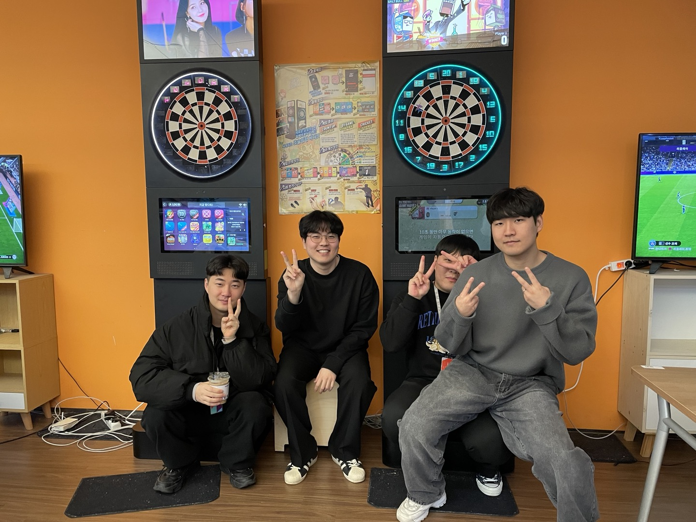

# remember

스마일게이트 개발 캠프 2023 - Remember

## 팀 소개
- 저희 팀은 총 백엔드 4명으로 이루어진 팀입니다. 
- 각각 Spring 개발자 2명, Node.js 개발자 1명, ASP.NET Core 개발자 1명으로 이루어져 있습니다.

## 기술 스택
### Frontend
- react
- zustand

### Backend
- Language
    - node.js, Nest.js
    - Java 17
    - Spring Boot 3.2.1
    - Spring MVC
    - C#
    - ASP.NET Core 16
- Library
    - WebSocket, STOMP, SockJS
    - mediasoup
    - socket.io
- Database
    - MSSQL
    - MySQL
    - Mongo DB
    - Redis
- Common
    - Jenkins(CI/CD)
    - Google Cloud Platform
    - Docker
    - NGINX
    - EFK
    - kafka

## 전체 아키텍처

## 역활 분담

### 김영현
- 커뮤니티 서버
- 로그 서버
- Jenkins
- NGINX
- GCP

### 최성민
- STUN + TURN 서버
- Media 서버

### 안재진
- 채팅 서버
- 상태 관리 서버
- kafka

### 홍지현
- Smile Gateway
- 유저 서버
- NGINX

### 프론트
- 모두가 함께 만듬.