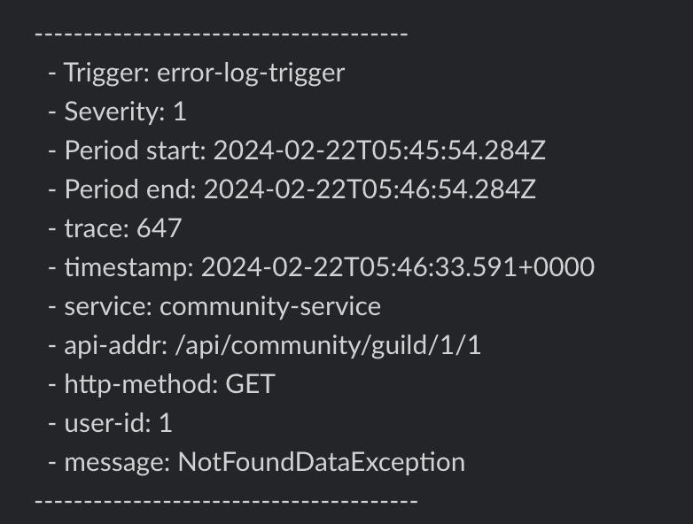

# 로그 서버

1. [서버 아키텍처](#서버-아키텍처)
2. [동작 방식](#동작-방식)
3. [트러블 슈팅](#트러블-슈팅)

## 서버 아키텍처

| 종류          | 도커 이미지                                            |
| ------------- | ------------------------------------------------------ |
| Fluentd       | `fluent/fluentd:edge-debian`                           |
| ElasticSearch | `docker.elastic.co/elasticsearch/elasticsearch:7.10.2` |
| Kibana        | `docker.elastic.co/kibana/kibana:7.10.2`               |

## 동작 방식
### fluentd
- 서버별로 fluentd를 띄우고 서버별로 구성되어 있는 로그 파일들을 각 서버별로 붙어 있는 사이드카 형태로 fluentd가 실시간 로그 처리를 하고 있습니다
~~~Dockerfile
FROM fluent/fluentd:edge-debian
ADD ./conf/fluentd.conf /fluentd/etc/fluentd.conf
USER root
RUN ["gem", "install", "elasticsearch", "--no-document", "--version", "7.17.10"]
RUN ["gem", "install", "fluent-plugin-elasticsearch","--no-document","--version","5.2.3"]
RUN ["gem", "uninstall", "--ignore-dependencies","faraday"]
RUN ["gem", "install", "faraday","--no-document","--version","1.10.0"]
USER fluent
~~~
~~~xml
<source>
  @type tail
  format json
  path /var/log/*.log
  pos_file /var/pos/service.pos
  tag fluentdlog.*
  refresh_interval 5s
</source>

<match **>
  @type copy
  <store>
    @type elasticsearch
    hosts http://elasticsearch:9200
    <buffer service, time>
      @type file
      path /var/buffer/elasticsearch
      timekey 30s
      flush_mode interval
      flush_interval 5s
      flush_thread_count 5
      retry_type exponential_backoff
      retry_forever false
      retry_wait 1
      retry_exponential_backoff_base 2
      retry_randomize true
      retry_max_interval 5m
      retry_timeout 72h
    </buffer>
    index_name fluentd-${service}-%Y%m%d
    include_tag_key true
    type_name access_log
    tag_key @log_name
    flush_interval 1s
    reconnect_on_error true
    reload_on_failure true
    reload_connections false
  </store>

  <store>
    @type stdout
  </store>
</match>
~~~
~~~yml
version: '3'
services:
  fluentd:
    build:
      context: ./fluentd/
      dockerfile: Dockerfile
    container_name: fluentd
    ports:
      - 24224:24224
    environment:
      - FLUENTD_CONF=fluentd.conf
    volumes:
      - ./fluentd/buffer:/var/buffer
      - ./fluentd/pos:/var/pos
      - logs:/var/log
    networks:
      - community-network

networks:
  community-network:

volumes:
  logs:
~~~
- fluentd를 통해 긁어온 로그들을 버퍼를 통해 ElasticSearch로 전송하고 있습니다
### ElasticSearch
- ElasticSearch DB에 fluentd로 보낸 로그들을 계속 쌓고 있습니다
~~~Dockerfile
FROM docker.elastic.co/elasticsearch/elasticsearch:7.10.2
RUN elasticsearch-plugin install --batch analysis-nori
RUN elasticsearch-plugin install -b https://github.com/opendistro-for-elasticsearch/alerting/releases/download/v1.13.1.0/alerting.zip
RUN mkdir -p /usr/share/elasticsearch/data
RUN chown -R elasticsearch:elasticsearch /usr/share/elasticsearch/data/nodes
RUN chmod -R 755 /usr/share/elasticsearch/data
~~~
~~~yml
cluster.name: "elasticsearch"
network.host: 0.0.0.0
path.repo: [ "/usr/share/elasticsearch/backup" ]

xpack.license.self_generated.type: trial
xpack.security.enabled: false
xpack.monitoring.collection.enabled: true

discovery.type: single-node
~~~
~~~yml
version: '3.4'
services:
  elasticsearch:
    container_name: elasticsearch
    build:
      context: ./elasticsearch/
      dockerfile: Dockerfile
    ports:
      - 9200:9200
      - 9300:9300
    environment:
      - "ELASTIC_PASSWORD=1q2w3e4r!"
      - "ES_JAVA_OPTS=-Xms512m -Xmx512m"
    volumes:
      - ./elasticsearch/config/elasticsearch.yml:/usr/share/elasticsearch/config/elasticsearch.yml
      - ./elasticsearch/data:/usr/share/elasticsearch/data
      - ./elasticsearch/backup:/usr/share/elasticsearch/backup
    networks:
      - community-network

networks:
  community-network:
~~~
### Kibana
- ElasticSearch DB에 저장된 로그들을 분석할 수 있으며 Alerting 기능을 통하여 에러 로그 발생 시 슬랙에 알람기능 
- trace-id를 통하여 분산 추적
- logging, tracing을 통한 Observability 구현
~~~yml
version: '3.4'
services:
  kibana:
    build:
      context: ./kibana/
      dockerfile: Dockerfile
    container_name: kibana
    environment:
      - ELASTICSEARCH_HOSTS=http://elasticsearch:9200
      - TZ=Asia/Seoul
    ports:
      - 5601:5601
    networks:
      - community-network

networks:
  community-network:
~~~
~~~Dockerfile
FROM docker.elastic.co/kibana/kibana:7.10.2
RUN kibana-plugin install https://github.com/opendistro-for-elasticsearch/alerting-kibana-plugin/releases/download/v1.13.0.0/opendistroAlertingKibana-1.13.0.0.zip
~~~

## 트러블 슈팅
### Docker 버전 문제
- MacOS에서 fluentd 버전 이슈
    - `fluent/fluentd:edge-debian` 사용하여 버전 문제 해결
- ElasticSearch, Kibana 버전 이슈
    - 특정 버전 이상 사용 시 알림 기능 유료화
    - `docker.elastic.co/elasticsearch/elasticsearch:7.10.2`,`docker.elastic.co/kibana/kibana:7.10.2` 버전으로 문제 해결
    - 알림 기능을 사용하려면 특정 기능 Download해야 함
        - 해당 기능을 공식 홈페이지에서 사용하려고 할 시 `Deprecated`됨
        - 공식 깃허브 아카이브에서 다운로드