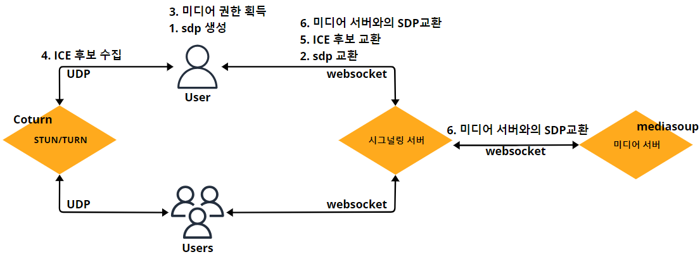
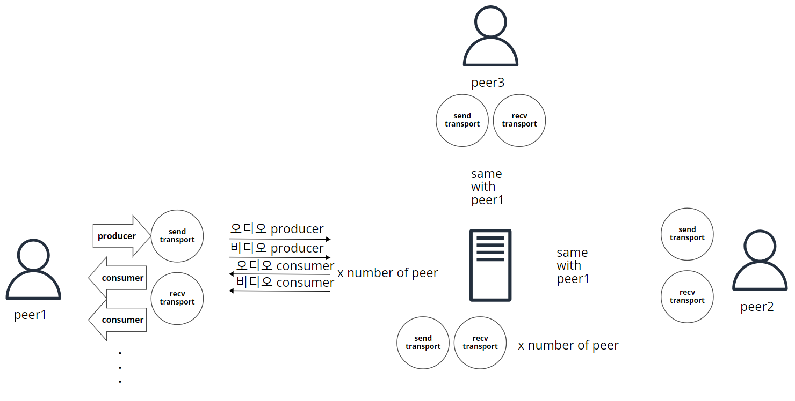
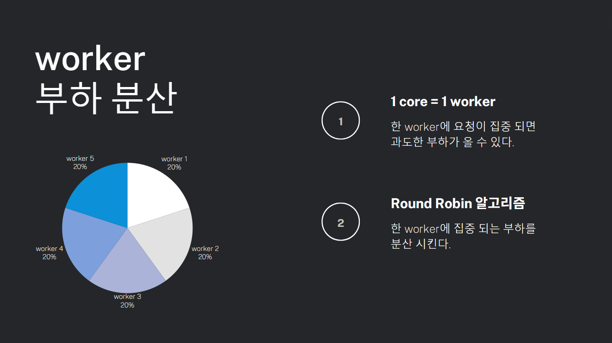
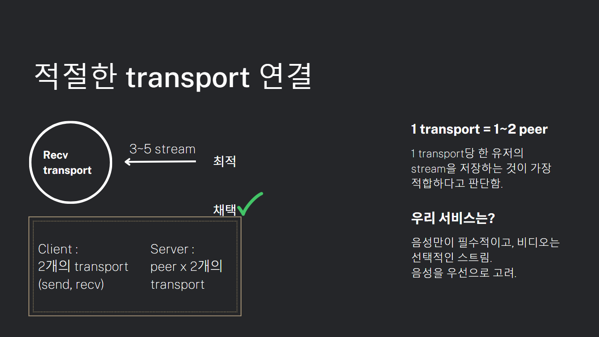

# Media server

0. [링크](#링크)
1. [기술 스택](#기술-스택)
2. [서버 아키텍처](#서버-아키텍처)
3. [구현 기능](#주요-구현-기능)
4. [중점 코드](#중점-코드)

## 링크

mediasoup 정리 : https://smaivnn.tistory.com/28  
데이터 구조 리팩토링 : https://github.com/smaivnn/mediasoup-tutorial-react-nestjs

## 기술 스택

| 종류        | 기술                            |
| ----------- | ------------------------------- |
| Language    | `node.js` `Nest.js`             |
| open source | `mediasoup` `socket.io` `kafka` |

## 서버 아키텍처

### 서버 기본 흐름



- SDP와 ICE과정 mediasoup 통합.
- Signaling과 Media 서버의 통합.

### mediasoup 아키텍처 ( N : M )



- Worker : 실시간 미디어 처리 작업을 수행하며 CPU 코어 하나에 할당된다.
- Router : "방"의 개념으로 미디어 스트림의 경로를 제어하는 역할.
- Transport : 클라이언트를 router와 연결해서 producer, consumer간 미디어 전송을 가능하게 한다. (RTP)

> 채택  
> client Transport : 2 (send, recv)  
> Server Transport : 2 x peer

## 주요 구현 기능

### worker 부하 분산




## 중점 코드

### worker 부하 분산

```javascript
  private nextWorkerIndex = 0;
  private workers: mediasoup.types.Worker[] = [];

  // 서버 시작 시
  async onModuleInit() {
    const numWorkers = os.cpus().length;

    for (let i = 0; i < numWorkers; ++i) {
      await this.createWorker();
    }
  }

  // worker 생성
  async createWorker() {
    const worker = await mediasoup.createWorker({
      // ...code
    });

    worker.on('died', () => {
      // ...code
    });

    this.workers.push(worker);
    return worker;
  }

  // worker 가져오기 (Round Robin)
  getWorker() {
    const worker = this.workers[this.nextWorkerIndex];
    this.nextWorkerIndex = (this.nextWorkerIndex + 1) % this.workers.length;
    return worker;
  }

```

### Client Transport

- FE/dev > hooks > useMediasoup.js >  
  createSendTransport / createRecvTransport

### Server Transport

```javascript
async createWebRtcTransport(
    data: CreateWebRtcTransportDTO,
  ): Promise<mediasoup.types.WebRtcTransport> {
    const { roomId } = data;

    try {
      const router = await this.getRouter(roomId);
      const transport = await router.createWebRtcTransport(
        this.webRtcTransport_options,
      );

      this.setTransport(data.consumer, data.socketId, transport);

      transport.on('dtlsstatechange', (dtlsState) => {
        switch (dtlsState) {
          case 'connected':
            console.log('>> dtlsstatechange connected');
            break;
          case 'failed':
            console.log('>> dtlsstatechange failed');
            break;
          case 'closed':
            console.log('>> dtlsstatechange closed');
            transport.close();
            break;
        }
      });

      return transport;
    } catch (error) {
      console.error(error);
    }
  }
```

## License

Nest is [MIT licensed](LICENSE).
