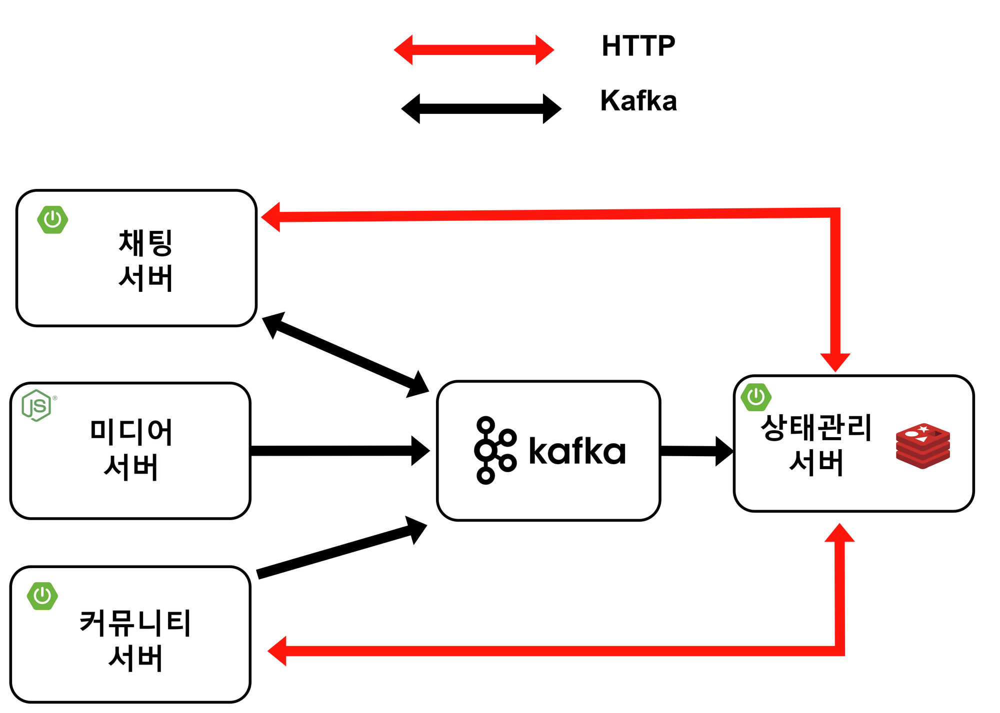

# 상태 관리 서버

## 기술 스택

- Java 17
- Spring Boot 3.2.1
- Kafka
- Redis

## 기능 정리

| 기능 | 설명                                                                                                                                                                                            |
| --- |-----------------------------------------------------------------------------------------------------------------------------------------------------------------------------------------------|
| 실시간 이벤트들 관리 | 채팅 서버로부터 오는 sessionId, userId, guildId, 유저의 on, off 상태값을 관리, 시그널링 서버로부터 오는 유저의 guildId, channelId, userId, 음성 채널 입, 퇴장 상태값을 관리, 커뮤니티 서버로부터 오는 유저의 on, off 상태 와 음성 채널 입, 퇴장 상태에 대한 요청 정보 응답 처리 |

## 아키텍처



## **핵심 구현 기능**

### 1. 음성 채널 이벤트 저장 로직

``` java
public class SignalingServerService {

    ....

    public void updateChannelEvent(ChannelEventDto channelEventDto) {
        HashOperations<String, String, Set<String>> hashOperations = redisTemplate.opsForHash();
        String hashKey = GUILD + SEP + channelEventDto.getGuildId();
        String channelId = String.valueOf(channelEventDto.getChannelId());

        Set<String> userIds = hashOperations.get(hashKey, channelId);
        if (channelEventDto.getType().equals("JOIN")) {
            if (userIds != null) {
                userIds.add(channelEventDto.getUserId());
                hashOperations.put(hashKey, channelId, userIds);
            } else {
                Set<String> joinedUserIds = new HashSet<>();
                joinedUserIds.add(channelEventDto.getUserId());
                hashOperations.put(hashKey, channelId, joinedUserIds);
            }
        } else if (channelEventDto.getType().equals("LEAVE")) {
            if (userIds != null) {
                userIds.remove(channelEventDto.getUserId());
                hashOperations.put(hashKey, channelId, userIds);
            }
        }

        redisTemplate.expire(hashKey, TIME, TimeUnit.SECONDS);
    }
}
```

- 음성 채널 이벤트 데이터 자료구조

| 키 | 필드 | 값 |
| --- | --- | --- |
| GUILD:guildId | channelId | userIds |

```
"channelStates": {
        "3": [],
        "5": [
            "1",
            "2",
            "3"
        ],
        "15": [
            "11",
            "1",
            "111"
        ]
    }
```

### 2. 온, 오프 상태 이벤트 저장 로직

``` java
public class ChatServerService {

    ....

    public BaseResponse<String> updateSession(SessionDto sessionDto) {
        HashOperations<String, Object, Object> hashOperations = redisTemplate.opsForHash();
        String sessionId = sessionDto.getSessionId();
        String stateKey = "USER:STATE";
        String userId = null;
        if (sessionDto.getType().equals("CONNECT")) {
            userId = String.valueOf(sessionDto.getUserId());
            if (userId == null) {
                return responseService.getFailResponse(null);
            }
            hashOperations.put(stateKey, userId, sessionDto.getState());
            saveSessionId(sessionId, userId);
        }
        if (sessionDto.getType().equals("DISCONNECT")) {
            userId = getUserId(sessionId);
            if (userId == null) {
                return responseService.getFailResponse(null);
            }
            hashOperations.put(stateKey, userId, sessionDto.getState());
            deleteSessionId(sessionId);
        }

        redisTemplate.expire(stateKey, TIME, TimeUnit.SECONDS);
        log.info("userId {}", userId);
        log.info("connection {}", sessionDto.getState());
        return responseService.getSuccessResponse(userId);
    }
}
```

- 온, 오프 상태 이벤트 데이터 자료구조

| 키 | 필드 | 값 |
| --- | --- | --- |
| USER:STATE | userId  | online |
| USER:STATE | userId  | offline |

```
"connectionStates": {
        "1": "offline",
        "2": "offline",
        "3": "offline",
        "4": "offline",
        "5": "online"
    }
```