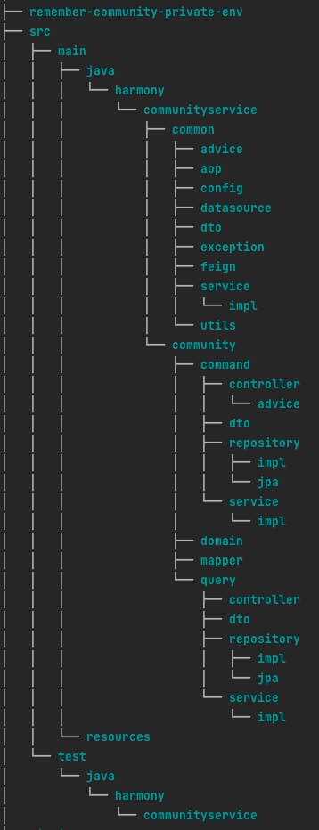
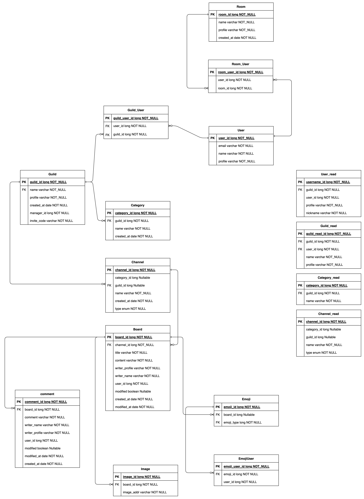

# 커뮤니티 서버

1. [서버 아키텍처](#서버-아키텍처)
2. [폴더 구조](#폴더-구조)
3. [ERD](#erd)
4. [동작 방식](#동작-방식)
5. [구현 기능 목록](#구현-기능-목록)
6. [리펙토링 일지](https://meteor-mallet-36a.notion.site/6ae93cdc1d024c639191ae3d3d43d396)

## 서버 아키텍처

| 종류     | 기술                          |
| -------- | ----------------------------- |
| Language | `JAVA17`, `SPRING BOOT 3.2.1` |
| Database | `MySQL`                       |
| Token    | `JWT`                         |

## 폴더 구조



## ERD



## 동작 방식

### CQRS

- MySQL RDBMS를 Source, Replica로 이중화를 실행하였으며 Source DB는 쓰기 전용 DB, Replica DB는 읽기 전용 DB로 분리하였습니다.
- 읽기 전용 테이블을 만들어 JOIN 연산을 최소화하여 빠른 조회를 할 수 있게 만들었습니다.
- Source와 Replica의 DB 동기화는 MySQL CDC를 통하여 Binary Log를 비동기식으로 Source에서 Replica로 전달하여 데이터 동기화를 실시하고 있습니다.
- 스프링 서버에서 Transactional Annotation(readOnly = true)일 때는 Replica DB, Transactional Annotaion(readOnly = false)일 때는 Source DB를 사용합니다.
- MySQL CDC를 활용한 데이터 동기화 시 1000만건 연속 Insert 기준 약 80만건(8%)의 딜레이가 발생 -> 대규모 서비스에서 치명적 결함
    - Kafka Connect 기반 Debezium 오픈소스로 Migration 실행
#### CQRS에 관한 자세한 내용은 [CQRS에 대한 생각](https://velog.io/@0chord/series/CQRS) 시리즈를 참고
```Java
public class RoutingDataSource extends AbstractRoutingDataSource {
    @Override
    protected Object determineCurrentLookupKey() {

        boolean isReadOnly = TransactionSynchronizationManager.isCurrentTransactionReadOnly();

        return isReadOnly ? "replica" : "source";
    }
}
```

### 로깅

- ECS(ElasticSearch Common Schema)에 맞춰서 Logging Data Structure를 구성했습니다.

```xml
<included>
    <appender name="FILE-INFO" class="ch.qos.logback.core.rolling.RollingFileAppender">
        <file>./log/info/info.log</file>
        <encoder>
            <pattern>{"@timestamp":"%d{yyyy-MM-dd'T'HH:mm:ss.SSSZ}","level":"%level","service":"${SPRING_APPLICATION_NAME}","trace":"%X{Trace-Id:-}","apiAddr":"%X{Api-Addr:-}","httpMethod":"%X{Http-Method:-}","userId":"%X{User-Id:-}","message":"%msg"}%n
            </pattern>
        </encoder>
        <rollingPolicy class="ch.qos.logback.core.rolling.SizeAndTimeBasedRollingPolicy">
            <fileNamePattern>./backup/info/info-%d{yyyy-MM-dd}.%i.log</fileNamePattern>
            <maxFileSize>100MB</maxFileSize>
            <maxHistory>30</maxHistory>
            <totalSizeCap>2GB</totalSizeCap>
        </rollingPolicy>
    </appender>
</included>
```

- AOP 패턴을 통해 비즈니스 코드 변경 없이 logging을 사용했습니다

```java
@Slf4j
@Aspect
@Component
@RequiredArgsConstructor
public class LogControllerAop {
    @Pointcut("execution(* harmony.communityservice.community.command.controller..*.*(..))")
    public void commandController() {
    }

    @Pointcut("execution(* harmony.communityservice.community.query.controller..*.*(..))")
    public void queryController() {
    }


    @Around("commandController()||queryController()")
    public Object logging(ProceedingJoinPoint joinPoint) throws Throwable {
        HttpServletRequest request = ((ServletRequestAttributes) RequestContextHolder.currentRequestAttributes()).getRequest();
        Signature signature = joinPoint.getSignature();
        String apiAddr = request.getRequestURI();
        String methodName = signature.getName();
        String traceId = request.getHeader("trace-id");
        String userId = request.getHeader("user-id");
        String httpMethod = request.getMethod();
        MDC.put("Trace-Id", traceId);
        MDC.put("Api-Addr", apiAddr);
        MDC.put("Http-Method", httpMethod);
        MDC.put("User-Id", userId);
        try {
            return joinPoint.proceed();
        } finally {
            log.info(methodName);
            MDC.remove("Trace-Id");
            MDC.remove("Api-Addr");
            MDC.remove("Http-Method");
            MDC.remove("User-Id");
        }
    }
}
```

```java
@Slf4j
@Aspect
@Component
@RequiredArgsConstructor
public class LogAop {

    @Pointcut("execution(* harmony.communityservice.community.command.service.impl..*.*(..))")
    public void commandService() {
    }

    @Pointcut("execution(* harmony.communityservice.community.command.repository.impl..*.*(..))")
    public void commandRepository() {
    }


    @Pointcut("execution(* harmony.communityservice.community.query.service.impl..*.*(..))")
    public void queryService() {
    }

    @Pointcut("execution(* harmony.communityservice.community.query.repository.impl..*.*(..))")
    public void queryRepository() {
    }


    @Around("commandService()||commandRepository()||queryService()||queryRepository()")
    public Object logging(ProceedingJoinPoint joinPoint) throws Throwable {
        Signature signature = joinPoint.getSignature();
        String methodName = signature.getName();
        try {
            return joinPoint.proceed();
        } finally {
            log.info(methodName);
        }
    }
}
```

### 에러 처리

- 에러 처리는 RuntimeException 상속을 받아 새로운 Exception을 만들고 RestControllerAdvice를 통해 진행하고 있습니다

```java
@Slf4j
@RestControllerAdvice
public class AllControllerAdvice {

    @ExceptionHandler(NotFoundDataException.class)
    public BaseResponse<?> exceptionHandler(NotFoundDataException e, HttpServletRequest request) {
        errorLogging(request, "NotFoundDataException");
        return new BaseResponse<>(HttpStatus.BAD_REQUEST.value(), "BAD_REQUEST",
                new BaseExceptionResponse("NOT_FOUND_DATA", 5000, "해당하는 데이터를 찾을 수 없습니다"));
    }

    @ExceptionHandler(HttpRequestMethodNotSupportedException.class)
    public BaseResponse<BaseExceptionResponse> exceptionHandler(HttpRequestMethodNotSupportedException e,
                                                                HttpServletRequest request) {
        errorLogging(request, "HttpRequestMethodNotSupportedException");
        return new BaseResponse<>(HttpStatus.BAD_REQUEST.value(), "BAD_REQUEST", new BaseExceptionResponse(
                "INVALID_INPUT", 5001, "잘못된 입력입니다"));
    }

    @ExceptionHandler(IllegalGcsException.class)
    public BaseResponse<BaseExceptionResponse> exceptionHandler(IllegalGcsException e, HttpServletRequest request) {
        errorLogging(request, "IllegalGcsException");
        return new BaseResponse<>(HttpStatus.BAD_REQUEST.value(), "BAD_REQUEST",
                new BaseExceptionResponse("INVALID_GCS_REQUEST", 5002, "잘못된 GCS 요청입니다"));
    }

    @ExceptionHandler(HttpMessageNotReadableException.class)
    public BaseResponse<BaseExceptionResponse> exceptionHandler(HttpMessageNotReadableException e,
                                                                HttpServletRequest request) {
        errorLogging(request,"HttpMessageNotReadableException");
        return new BaseResponse<>(HttpStatus.BAD_REQUEST.value(), "BAD_REQUEST",
                new BaseExceptionResponse("INVALID_INPUT", 5001, "잘못된 입력입니다"));
    }

}
```

## 구현 기능 목록

### 커뮤니티

- 길드
- 채널
- 포럼
- 댓글
- 이모지
- 길드 내 유저 온/오프라인
- [POSTMAN API](https://documenter.getpostman.com/view/25831351/2sA2rAz35h)

### DM

- DM 방 생성
- DM 방에 있는 유저의 실시간 상태
- [POSTMAN API](https://documenter.getpostman.com/view/25831351/2sA2rAz35i)

### 유저

- 서버별 유저 이름 변경
- 유저 이미지 변경
- [POSTMAN API](https://documenter.getpostman.com/view/25831351/2sA2rAz35k)

```yml
version: "3"

services:
  community-service:
    build:
      context: .
      dockerfile: Dockerfile-community
    container_name: community-service
    ports:
      - "8000:8000"
    volumes:
      - logs:/log/info
    networks:
      - community-network
    environment:
      - SPRING_DATASOURCE_SOURCE_HIKARI_JDBC_URL=jdbc:mysql://10.178.0.3:3307/harmony?useSSL=false&characterEncoding=UTF-8&serverTimeZone=Asia/Seoul
      - SPRING_DATASOURCE_REPLICA_HIKARI_JDBC_URL=jdbc:mysql://10.178.0.3:3308/harmony?useSSL=false&characterEncoding=UTF-8&serverTimeZone=Asia/Seoul
networks:
  community-network:

volumes:
  logs:
```
