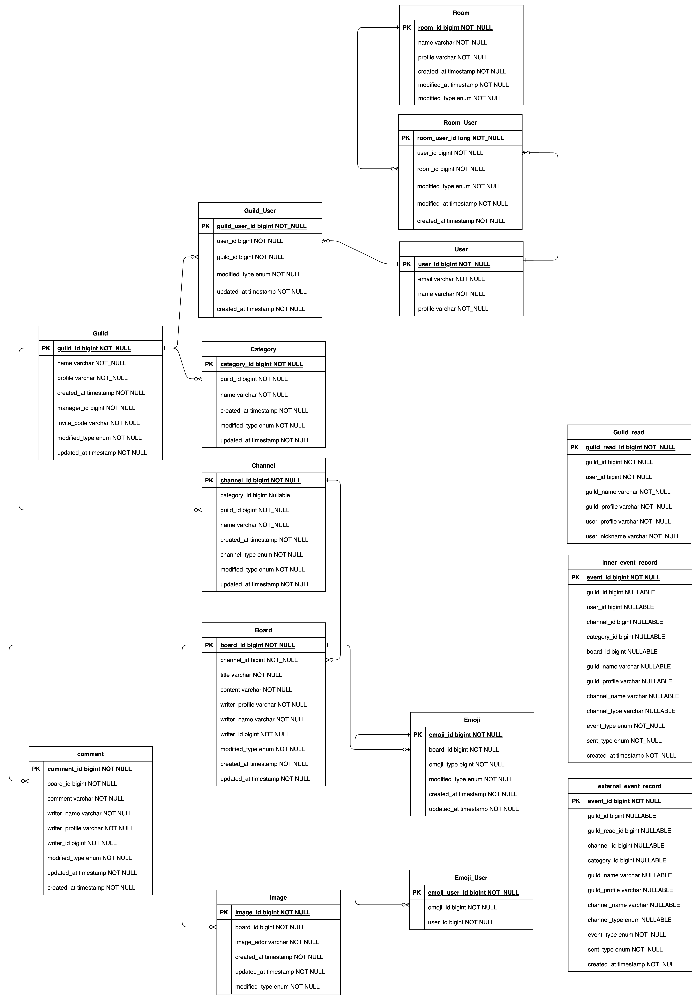
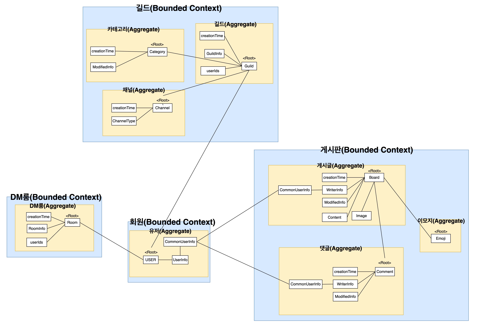
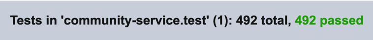
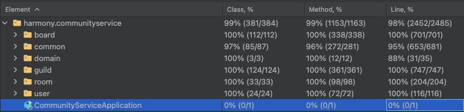
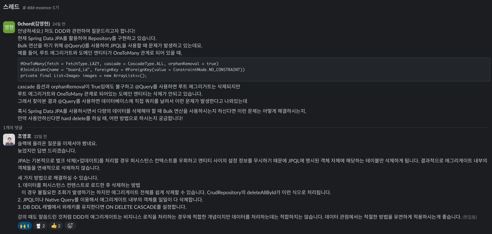

# 커뮤니티 서버

1. [서버 코드](../../../src/backend/community-service)
2. [서버 아키텍처](#서버-아키텍처)
3. [폴더 구조](#폴더-구조)
4. [ERD](#erd)
5. [도메인 구조](#도메인-구조)
6. [동작 방식](#동작-방식)
7. [구현 기능 목록](#구현-기능-목록)
8. [기능 테스트](#기능-테스트)
9. [성능 측정 결과](#성능-측정-결과)
10. [트러블 슈팅](#트러블-슈팅)
11. [리펙토링 일지](https://meteor-mallet-36a.notion.site/6ae93cdc1d024c639191ae3d3d43d396)

## 서버 아키텍처

| 종류       | 기술                            |
|----------|-------------------------------|
| Language | `JAVA17`, `SPRING BOOT 3.2.1` |
| Database | `MySQL`                       |
| Token    | `JWT`                         |
| CDC      | `Debezium`                    |
| Test     | `K6`, `JUnit5`, `Mokito`       |
## 폴더 구조
```
.
├── main
│   ├── java
│   │   └── harmony
│   │       └── communityservice
│   │           ├── board
│   │           │   ├── board
│   │           │   │   ├── adapter
│   │           │   │   │   ├── in
│   │           │   │   │   │   └── web
│   │           │   │   │   └── out
│   │           │   │   │       └── persistence
│   │           │   │   ├── application
│   │           │   │   │   ├── port
│   │           │   │   │   │   ├── in
│   │           │   │   │   │   └── out
│   │           │   │   │   └── service
│   │           │   │   └── domain
│   │           │   ├── comment
│   │           │   │   ├── adapter
│   │           │   │   │   ├── in
│   │           │   │   │   │   └── web
│   │           │   │   │   └── out
│   │           │   │   │       └── persistence
│   │           │   │   ├── application
│   │           │   │   │   ├── port
│   │           │   │   │   │   ├── in
│   │           │   │   │   │   └── out
│   │           │   │   │   └── service
│   │           │   │   └── domain
│   │           │   └── emoji
│   │           │       ├── adapter
│   │           │       │   ├── in
│   │           │       │   │   └── web
│   │           │       │   └── out
│   │           │       │       └── persistence
│   │           │       ├── application
│   │           │       │   ├── port
│   │           │       │   │   ├── in
│   │           │       │   │   └── out
│   │           │       │   └── service
│   │           │       └── domain
│   │           ├── common
│   │           │   ├── advice
│   │           │   ├── annotation
│   │           │   ├── aop
│   │           │   ├── api
│   │           │   ├── client
│   │           │   │   ├── feign
│   │           │   │   └── impl
│   │           │   ├── config
│   │           │   ├── datasource
│   │           │   ├── domain
│   │           │   ├── dto
│   │           │   ├── event
│   │           │   │   ├── dto
│   │           │   │   │   ├── inner
│   │           │   │   │   └── produce
│   │           │   │   └── handler
│   │           │   ├── exception
│   │           │   ├── generic
│   │           │   ├── interceptor
│   │           │   ├── outbox
│   │           │   ├── service
│   │           │   │   └── impl
│   │           │   └── utils
│   │           ├── guild
│   │           │   ├── category
│   │           │   │   ├── adapter
│   │           │   │   │   ├── in
│   │           │   │   │   │   └── web
│   │           │   │   │   └── out
│   │           │   │   │       └── persistence
│   │           │   │   ├── application
│   │           │   │   │   ├── port
│   │           │   │   │   │   ├── in
│   │           │   │   │   │   └── out
│   │           │   │   │   └── service
│   │           │   │   └── domain
│   │           │   ├── channel
│   │           │   │   ├── adapter
│   │           │   │   │   ├── in
│   │           │   │   │   │   └── web
│   │           │   │   │   └── out
│   │           │   │   │       └── persistence
│   │           │   │   ├── application
│   │           │   │   │   ├── port
│   │           │   │   │   │   ├── in
│   │           │   │   │   │   └── out
│   │           │   │   │   └── service
│   │           │   │   └── domain
│   │           │   └── guild
│   │           │       ├── adapter
│   │           │       │   ├── in
│   │           │       │   │   └── web
│   │           │       │   └── out
│   │           │       │       └── persistence
│   │           │       ├── application
│   │           │       │   ├── port
│   │           │       │   │   ├── in
│   │           │       │   │   └── out
│   │           │       │   └── service
│   │           │       └── domain
│   │           ├── room
│   │           │   ├── adapter
│   │           │   │   ├── in
│   │           │   │   │   └── web
│   │           │   │   └── out
│   │           │   │       └── persistence
│   │           │   ├── application
│   │           │   │   ├── port
│   │           │   │   │   ├── in
│   │           │   │   │   └── out
│   │           │   │   └── service
│   │           │   └── domain
│   │           └── user
│   │               ├── adapter
│   │               │   ├── in
│   │               │   │   └── web
│   │               │   └── out
│   │               │       └── persistence
│   │               ├── application
│   │               │   ├── port
│   │               │   │   ├── in
│   │               │   │   └── out
│   │               │   └── service
│   │               └── domain
│   └── resources
│       └── mybatis
│           └── mapper
```

## ERD


## 도메인 구조

## 동작 방식

### 도메인 주도 설계
- 담당 도메인을 `서브 도메인(Ideal Problem Space)`으로 분리한 후 `Bounded Context(Problem Solving Space)`를 통해 경계를 분리했습니다.
- `일관성`과 `불변식`을 기준으로 `Aggregate`를 구성했습니다.
- 한 트랜잭션에서 하나의 애그리거트만을 처리하기 위해 `Spring EventListener`를 활용하여 이벤트를 발행해 `Transaction`을 격리했습니다.
- 외부에 영향을 받지 않는 순수한 도메인 로직을 보장하기 위해 `Hexagonal Architecture`를 사용하여 프로젝트를 진행했습니다.
- 도메인 로직에서 쓰기 로직과 읽기 로직을 분리하여 부하를 분산하기 위해 `CQRS` 패턴을 사용했습니다.

### EDA(Event Driven Architecture)
- 커뮤니티 서비스는 `길드 생성`, `수정`, `삭제` 등의 변화가 발생할 때 실시간으로 `소켓 서버`와 통신을 하여 변화를 전달해야 합니다.
- `커뮤니티 서비스`와 `소켓 서버`은 `비동기`로 요청을 처리하는게 좋고 `커뮤니티 서비스`와 `소켓 서버`가 시간이 지나면서 확장될 수 있었고 두 서버간 `느슨한 결합`을 고려했고 `Kafka` 기반 `EDA`를 사용했습니다.
```java
@RequiredArgsConstructor
public class KafkaEventProducer implements EventProducer {

    private final KafkaTemplate<String, ExternalEvent> externalEventKafkaTemplate;
    @Value("${spring.kafka.producer.community-event-topic}")
    private String communityEvent;

    @Override
    public void publishGuildDeletionEvent(ExternalEvent event) {
        externalEventKafkaTemplate.send(communityEvent, event);
    }

    @Override
    public void publishChannelCreationEvent(ExternalEvent event) {
        externalEventKafkaTemplate.send(communityEvent, event);
    }

    @Override
    public void publishChannelDeletionEvent(ExternalEvent event) {
        externalEventKafkaTemplate.send(communityEvent, event);
    }

    @Override
    public void publishGuildCreationEvent(ExternalEvent event) {
        externalEventKafkaTemplate.send(communityEvent, event);
    }
}
```
- 한 트랜잭션에서 하나의 애그리거트만을 처리하기 위해 `Spring EventListener`를 활용하여 이벤트를 발행해 `Transaction`을 격리했습니다.
```java
    @Async
    @Transactional(propagation = Propagation.REQUIRES_NEW)
    @Retryable(retryFor = {Exception.class}, maxAttempts = 3, backoff = @Backoff(delay = 2000L))
    @TransactionalEventListener(classes = DeleteCommentEvent.class, phase = TransactionPhase.AFTER_COMMIT)
    public void commentsDeleteEventAfterHandler(DeleteCommentEvent event) {
            deleteCommentsUseCase.deleteByBoardId(BoardId.make(innerEventRecord.getBoardId()));
    }
```
- `Inner Event`와 `External Event` 발행 보장하기 위해 `Transaction OutBox Pattern`을 사용했습니다.
- [트랜잭셔널 아웃박스 패턴의 실제 구현 사례 (29CM)](https://medium.com/@greg.shiny82/%ED%8A%B8%EB%9E%9C%EC%9E%AD%EC%85%94%EB%84%90-%EC%95%84%EC%9B%83%EB%B0%95%EC%8A%A4-%ED%8C%A8%ED%84%B4%EC%9D%98-%EC%8B%A4%EC%A0%9C-%EA%B5%AC%ED%98%84-%EC%82%AC%EB%A1%80-29cm-0f822fc23edb)에서 도움을 많이 받았습니다.
```java
@TransactionalEventListener(classes = RegisterGuildReadEvent.class, phase = TransactionPhase.BEFORE_COMMIT)
public void guildReadRegisterBeforeHandler(RegisterGuildReadEvent event) { 
    InnerEventRecord record = createGuildReadRegisterEvent(event);
    outBoxMapper.insertInnerEventRecord(record);
}
```
- 트랜잭션이 커밋되기 전에 해당 이벤트 로그를 DB에 저장합니다.
```java
    @Async
    @Transactional(propagation = Propagation.REQUIRES_NEW)
    @Retryable(retryFor = {Exception.class}, maxAttempts = 3, backoff = @Backoff(delay = 2000L))
    @TransactionalEventListener(classes = RegisterGuildReadEvent.class, phase = TransactionPhase.AFTER_COMMIT)
    public void guildReadRegisterAfterHandler(RegisterGuildReadEvent event) {
        InnerEventRecord record = createGuildReadRegisterEvent(event);
        InnerEventRecord innerEventRecord = outBoxMapper.findInnerEventRecord(record)
                .orElseThrow(NotFoundDataException::new);
        try {
            RegisterGuildReadCommand registerGuildReadCommand = RegisterGuildReadCommandMapper.convert(
                    innerEventRecord);
            registerGuildReadUseCase.register(registerGuildReadCommand);
            outBoxMapper.updateInnerEventRecord(SentType.SEND_SUCCESS, innerEventRecord.getEventId());
        } catch (Exception e) {
            outBoxMapper.updateInnerEventRecord(SentType.SEND_FAIL, innerEventRecord.getEventId());
        }
    }
```
- 트랜잭션이 커밋된 후에 새로운 트랜잭션으로 해당 로직을 처리합니다. 성공시 이벤트 로그를 성공으로 업데이트하고, 실패시 이벤트 로그를 실패로 업데이트합니다.
```java
    @Override
    @Transactional
    public void delete(DeleteGuildCommand deleteGuildCommand) {
        deleteGuildPort.delete(GuildId.make(deleteGuildCommand.guildId()), UserId.make(deleteGuildCommand.userId()));
        Events.send(GuildDeletedEventMapper.convert(deleteGuildCommand.guildId()));
        Events.send(new DeleteGuildReadEvent(deleteGuildCommand.guildId()));
        Events.send(new DeleteCategoryEvent(deleteGuildCommand.guildId()));
        Events.send(new DeleteChannelEvent(deleteGuildCommand.guildId()));
    }
```
- 외부 이벤트 시스템에 의존하지 않는 `POJO` 형태로 이벤트를 발송할 수 있습니다.
- 추후에 실패한 이벤트 로그들 중 생성된지 5분이상인 이벤트들을 배치처리 하는 방안을 고려중입니다.
### Hexagonal Architecture
```
├── room
│   ├── adapter
│   │   ├── in
│   │   │   └── web
│   │   └── out
│   │       └── persistence
│   ├── application
│   │   ├── port
│   │   │   ├── in
│   │   │   └── out
│   │   └── service
│   └── domain
└── user
│  ├── adapter
│  │   ├── in
│  │   │   └── web
│  │   └── out
│  │       └── persistence
│  ├── application
│  │   ├── port
│  │   │   ├── in
│  │   │   └── out
│  │   └── service
│  └── domain
```
- 외부 시스템에 영향을 받지 않는 순수한 도메인 로직을 위해 헥사고날 아키텍처를 사용했습니다
- `input-port`를 통해 `input-adapter`와 통신하며 `output-port`를 통해 `output-adapter(persistence layer)`와 통신합니다
- `JPA Entity`와 `Domain Entity`를 격리하여 `JPA`같은 외부 시스템에 종속되지 않는 순수한 도메인 로직을 작성했습니다
```java
@Getter
@Entity
@Table(name = "user")
@NoArgsConstructor(access = AccessLevel.PROTECTED)
class UserEntity extends AggregateRoot<UserEntity, UserIdJpaVO> {

    @EmbeddedId
    @Column(name = "user_id")
    private UserIdJpaVO userId;

    @Embedded
    private UserInfoJpaVO userInfo;

    @Version
    private Long version;

    @Builder
    public UserEntity(UserIdJpaVO userId, String email, String nickname, String profile) {
        this.userId = userId;
        this.userInfo = makeUserInfo(email, nickname, profile);
    }

    private UserInfoJpaVO makeUserInfo(String email, String nickname, String profile) {
        return UserInfoJpaVO.make(email, nickname, profile);
    }

    @Override
    public UserIdJpaVO getId() {
        return userId;
    }
}
```
```java
@Getter
@AllArgsConstructor(access = AccessLevel.PRIVATE)
public class User {

    private final UserId userId;

    private final UserInfo userInfo;

    @Builder
    public User(Long userId, String email, String nickname, String profile) {
        this.userId = UserId.make(userId);
        this.userInfo = UserInfo.make(email, profile, nickname);
    }

    public User modifiedProfile(String profile) {
        UserInfo modifiedUserInfo = userInfo.modifyProfile(profile);
        return new User(this.userId, modifiedUserInfo);
    }

    @Getter
    public static class UserId {

        private final Long id;

        private UserId(Long id) {
            this.id = id;
        }

        public static UserId make(Long id) {
            return new UserId(id);
        }
    }
}
```
- 로직이 추가될 때 `Port`만 추가하고 구현만 하면 되기에 유연한 확장이 가능합니다
### CQRS(Command Query Responsibility Segregation)

- `MySQL` RDBMS를 Source, Replica로 이중화를 실행하였으며 Source DB는 쓰기 전용 DB, Replica DB는 읽기 전용 DB로 분리하였습니다.
- 읽기 전용 테이블을 만들어 JOIN 연산을 최소화하여 빠른 조회를 할 수 있게 만들었습니다.
```mysql
+---------------+--------------------------+------+-----+---------+----------------+
| Field         | Type                     | Null | Key | Default | Extra          |
+---------------+--------------------------+------+-----+---------+----------------+
| created_at    | timestamp(3)             | YES  |     | NULL    |                |
| updated_at    | timestamp(3)             | YES  |     | NULL    |                |
| guild_id      | bigint                   | YES  |     | NULL    |                |
| guild_read_id | bigint                   | NO   | PRI | NULL    | auto_increment |
| user_id       | bigint                   | YES  | MUL | NULL    |                |
| user_profile  | varchar(255)             | YES  |     | NULL    |                |
| user_nickname | varchar(255)             | YES  |     | NULL    |                |
| guild_name    | varchar(255)             | YES  |     | NULL    |                |
| guild_profile | varchar(255)             | YES  |     | NULL    |                |
| modified_type | enum('MODIFY','NOT_YET') | YES  |     | NOT_YET |                |
+---------------+--------------------------+------+-----+---------+----------------+

```
- MySQL CDC를 활용한 `Source DB`와 `Replica DB`의 데이터 동기화 시 1000만건 연속 Insert 기준 약 80만건(8%)의 딜레이가 발생했습니다.
- 그래서 `Kafka Connect`기반 `Debezium`을 통하여 동기화를 진행하고 있습니다.
- `SMT(Simple Message Transformation)`을 통해 `Debezium` 설정을 진행하고 있습니다.
```
curl --location --request POST 'http://localhost:8083/connectors' \
--header 'Content-Type: application/json' \
--data-raw '{
  "name": "source-connector",
  "config": {
    "connector.class": "io.debezium.connector.mysql.MySqlConnector",
    "tasks.max": "1",
    "database.hostname": "source",
    "database.port": "3306",
    "database.user": "0chord",
    "database.password": "1q2w3e4r!",
    "database.server.id": "184054",
    "database.server.name": "dbserver1",
    "database.allowPublicKeyRetrieval": "true",
    "database.include.list": "harmony",
    "database.history.kafka.bootstrap.servers": "kafka:9092",
    "database.history.kafka.topic": "dbhistory.harmony",
    "key.converter": "org.apache.kafka.connect.json.JsonConverter",
    "key.converter.schemas.enable": "true",
    "value.converter": "org.apache.kafka.connect.json.JsonConverter",
    "value.converter.schemas.enable": "true",
    "transforms": "unwrap,addTopicPrefix",
    "transforms.unwrap.type": "io.debezium.transforms.ExtractNewRecordState",
    "transforms.unwrap.delete.handling.mode": "none",
    "transforms.unwrap.drop.tombstones": "false",
    "delete.handling​.mode": "none",
    "transforms.addTopicPrefix.type":"org.apache.kafka.connect.transforms.RegexRouter",
    "transforms.addTopicPrefix.regex":"(.*)",
    "transforms.addTopicPrefix.replacement":"$1"
  }
}'
```
```
curl --location --request POST 'http://localhost:8083/connectors' \
--header 'Content-Type: application/json' \
--data-raw '{
  "name": "sink-connector",
  "config": {
    "connector.class": "io.confluent.connect.jdbc.JdbcSinkConnector",
    "tasks.max": "1",
    "connection.url": "jdbc:mysql://replica:3306/harmony?user=0chord&password=1q2w3e4r!",
    "auto.create": "true",
    "auto.evolve": "false",
    "delete.enabled": "true",
    "insert.mode": "upsert",
    "pk.mode": "record_key",
    "table.name.format":"${topic}",
    "tombstones.on.delete": "true",
    "connection.user": "0chord",
    "connection.password": "1q2w3e4r!",
    "topics.regex": "dbserver1.harmony.(.*)",
    "key.converter": "org.apache.kafka.connect.json.JsonConverter",
    "key.converter.schemas.enable": "true",
    "value.converter": "org.apache.kafka.connect.json.JsonConverter",
    "value.converter.schemas.enable": "true",
    "transforms": "unwrap, route, TimestampCreatedAtConverter, TimestampUpdatedAtConverter",
    "transforms.unwrap.type": "io.debezium.transforms.ExtractNewRecordState",
    "transforms.unwrap.drop.tombstones": "false",
    "transforms.unwrap.delete.handling.mode": "none",
    "transforms.route.type": "org.apache.kafka.connect.transforms.RegexRouter",
    "transforms.route.regex": "([^.]+)\\.([^.]+)\\.([^.]+)",
    "transforms.route.replacement": "$3",
    "transforms.TimestampCreatedAtConverter.type": "org.apache.kafka.connect.transforms.TimestampConverter$Value",
    "transforms.TimestampCreatedAtConverter.target.type": "Timestamp",
    "transforms.TimestampCreatedAtConverter.field": "created_at",
    "transforms.TimestampCreatedAtConverter.format": "yyyy-MM-dd'T'HH:mm:ss.SSS'Z'",
    "transforms.TimestampUpdatedAtConverter.type": "org.apache.kafka.connect.transforms.TimestampConverter$Value",
    "transforms.TimestampUpdatedAtConverter.target.type": "Timestamp",
    "transforms.TimestampUpdatedAtConverter.field": "updated_at",
    "transforms.TimestampUpdatedAtConverter.format": "yyyy-MM-dd'T'HH:mm:ss.SSS'Z'"
  }
}'
```
- 스프링 서버에서 `@Transactional(readOnly = true)`일 때는 `Replica DB`, `@Transactional(readOnly = false)`일 때는 `Source DB`를 사용합니다.

```Java
public class RoutingDataSource extends AbstractRoutingDataSource {
    @Override
    protected Object determineCurrentLookupKey() {

        boolean isReadOnly = TransactionSynchronizationManager.isCurrentTransactionReadOnly();

        return isReadOnly ? "replica" : "source";
    }
}
```

### 로깅

- `ECS(ElasticSearch Common Schema)`에 맞춰서 `Logging Data Structure를 구성했습니다.

```xml
<included>
  <appender name="FILE-INFO" class="ch.qos.logback.core.rolling.RollingFileAppender">
    <file>./log/info/info.log</file>
    <encoder>
      <pattern>{"@timestamp":"%d{yyyy-MM-dd'T'HH:mm:ss.SSSZ}","level":"%level","service":"${SPRING_APPLICATION_NAME}",
        "trace":"%X{Trace-Id:-}","apiAddr":"%X{Api-Addr:-}","httpMethod":"%X{Http-Method:-}",
        "userId":"%X{User-Id:-}","message":"%msg"}%n
      </pattern>
    </encoder>
    <rollingPolicy class="ch.qos.logback.core.rolling.SizeAndTimeBasedRollingPolicy">
      <fileNamePattern>./backup/info/info-%d{yyyy-MM-dd}.%i.log</fileNamePattern>
      <maxFileSize>100MB</maxFileSize>
      <maxHistory>30</maxHistory>
      <totalSizeCap>2GB</totalSizeCap>
    </rollingPolicy>
  </appender>
</included>
```

- `Interceptor`와 `Spring AOP`를 통해 비즈니스 코드 변경 없이 `logging`을 사용했습니다
- `Interceptor`를 통해 요청이 들어올 때 `MDC`에 로그에 필요한 정보들을 저장합니다
```java
@Component
public class RegisterLogInfoInterceptor implements HandlerInterceptor {
    @Override
    public boolean preHandle(HttpServletRequest request, HttpServletResponse response, Object handler)
            throws Exception {
        MDC.put("Trace-Id", request.getHeader("trace-id"));
        MDC.put("Api-Addr", request.getRequestURI());
        MDC.put("Http-Method", request.getMethod());
        MDC.put("User-Id", request.getHeader("user-id"));
        return true;
    }

    @Override
    public void afterCompletion(HttpServletRequest request, HttpServletResponse response, Object handler, Exception ex)
            throws Exception {
        MDC.remove("Trace-Id");
        MDC.remove("Api-Addr");
        MDC.remove("Http-Method");
        MDC.remove("User-Id");
    }
}
```
- 경로 파악을 위해 `Spring AOP`를 통해 로깅을 합니다.
```java
@Around("board()||comment()||emoji()||common()||category()||channel()||guild()||room()||user()")
public Object logging(ProceedingJoinPoint joinPoint) throws Throwable {
  try {
    return joinPoint.proceed();
  } finally {
    Signature signature = joinPoint.getSignature();
    String className = joinPoint.getTarget().getClass().getSimpleName();
    infoLogPrinter.logging(className + "-" + signature.getName());
  }
}
```

### 에러 처리

- 에러 처리는 `RuntimeException` 상속을 받아 새로운 `Exception`을 만들고 `RestControllerAdvice`를 통해 진행하고 있습니다

```java
@Slf4j
@RestControllerAdvice
public class AllControllerAdvice {

    @ExceptionHandler(NotFoundDataException.class)
    public BaseResponse<?> exceptionHandler(NotFoundDataException e, HttpServletRequest request) {
        errorLogging(request, "NotFoundDataException");
        return new BaseResponse<>(HttpStatus.BAD_REQUEST.value(), "BAD_REQUEST",
                new BaseExceptionResponse("NOT_FOUND_DATA", 5000, "해당하는 데이터를 찾을 수 없습니다"));
    }

    @ExceptionHandler(HttpRequestMethodNotSupportedException.class)
    public BaseResponse<BaseExceptionResponse> exceptionHandler(HttpRequestMethodNotSupportedException e,
                                                                HttpServletRequest request) {
        errorLogging(request, "HttpRequestMethodNotSupportedException");
        return new BaseResponse<>(HttpStatus.BAD_REQUEST.value(), "BAD_REQUEST", new BaseExceptionResponse(
                "INVALID_INPUT", 5001, "잘못된 입력입니다"));
    }

    @ExceptionHandler(IllegalGcsException.class)
    public BaseResponse<BaseExceptionResponse> exceptionHandler(IllegalGcsException e, HttpServletRequest request) {
        errorLogging(request, "IllegalGcsException");
        return new BaseResponse<>(HttpStatus.BAD_REQUEST.value(), "BAD_REQUEST",
                new BaseExceptionResponse("INVALID_GCS_REQUEST", 5002, "잘못된 GCS 요청입니다"));
    }

    @ExceptionHandler(HttpMessageNotReadableException.class)
    public BaseResponse<BaseExceptionResponse> exceptionHandler(HttpMessageNotReadableException e,
                                                                HttpServletRequest request) {
        errorLogging(request,"HttpMessageNotReadableException");
        return new BaseResponse<>(HttpStatus.BAD_REQUEST.value(), "BAD_REQUEST",
                new BaseExceptionResponse("INVALID_INPUT", 5001, "잘못된 입력입니다"));
    }

}
```

## 구현 기능 목록

### 커뮤니티

- 길드
- 채널
- 포럼
- 댓글
- 이모지
- 길드 내 유저 온/오프라인
- [POSTMAN API](https://documenter.getpostman.com/view/25831351/2sA2rAz35h)

### DM

- DM 방 생성
- DM 방에 있는 유저의 실시간 상태
- [POSTMAN API](https://documenter.getpostman.com/view/25831351/2sA2rAz35i)

### 유저

- 서버별 유저 이름 변경
- 유저 이미지 변경
- [POSTMAN API](https://documenter.getpostman.com/view/25831351/2sA2rAz35k)

## 기능 테스트
- 애플리케이션이 요구 사항에 따라 제대로 작동하는지 확인하기 위해 `Junit`, `Mokito` 등을 사용하여 `Unit Test`, `Integration Test`를 진행했습니다.
- 총 테스트 코드는 `492개`를 작성했으며, `Line Coverage`는 `98%`를 달성했습니다.
  
  

## 성능 측정 결과
- TPS `52.7%` 향상, RPS `17.2%` 향상
### TPS

| 측정  | 요청 개수 | 진행 시간 | TPS |
| --- | --- | --- | --- |
| 1차 | 38,034 | 120s | 316.9 |
| 2차 | 64,591 | 120s | 517.3 |
| 3차 | 649 | 120s | 12.9 |
| 4차 | 58,083 | 120s | 484 |
### RPS
| 측정  | 요청 개수 | 진행 시간 | RPS |
| --- | --- | --- | --- |
| 1차 | 46047 | 120.4s | 509.3 |
| 2차 | 26830 | 45s | 596.1 |

## 트러블 슈팅
### 문제
> `Kafka Connect`는 각 데이터베이스 테이블이 `Topic`으로 구성되어 있다.
```
root@e54dcf444793:/# kafka-topics.sh --list --bootstrap-server kafka:9092
__consumer_offsets
communityEvent
connect-configs
connect-offsets
connect-status
dbhistory.harmony
dbserver1
dbserver1.harmony.board
dbserver1.harmony.category
dbserver1.harmony.channel
dbserver1.harmony.comment
dbserver1.harmony.emoji
dbserver1.harmony.emoji_user
dbserver1.harmony.external_event_record
dbserver1.harmony.guild
dbserver1.harmony.guild_read
dbserver1.harmony.guild_user
dbserver1.harmony.image
dbserver1.harmony.inner_event_record
dbserver1.harmony.room
dbserver1.harmony.room_user
dbserver1.harmony.user
```
>연관관계가 맺어있는 테이블을 `트랜잭션`할 때, 각 테이블의 레코드 정보가 `토픽`에 저장되기 때문에 테이블 간 `순서보장`이 되지 않는다. 그래서 `FK`가 있는 자식 테이블에 먼저 데이터가 저장되거나 삭제될 수 있어 `참조무결성`때문에 오류가 발생한다.
### 해결
```java
@OneToMany(fetch = FetchType.LAZY, cascade = CascadeType.ALL, orphanRemoval = true)
@JoinColumn(name = "board_id", foreignKey = @ForeignKey(value = ConstraintMode.NO_CONSTRAINT))
private final List<ImageEntity> images = new ArrayList<>();
```
- `FK`를 제거하여 `부모 테이블`보다 `자식 테이블`에 먼저 데이터가 저장되거나 삭제되어도 문제가 없게 만들었다.

### 문제
> `DDD`에서는 `일관성`을 위해 `루트엔티티`만 리포지토리가 있고 내부 `도메인엔티티`는 리포지토리가 없다.
> 그런데 `JPQL`을 통한 `Bulk`연산으로 `Delete`, `Update` 명령을 할 때 `Persistence Context`를 거치지 않고 바로 `DB`에 `Query`를 날리기 때문에 `루트엔티티`만 삭제되고 `도메인엔티티`는 삭제되지 않는다.
> 그래서 `도메인엔티티`를 삭제하기 위해 어떻게 해야할까? 고민을 하고 있었고 조영호님께 문의를 드렸다.


### 해결
- 첫 번째 방법은 `Persistence Context`를 통해 쉽게 삭제가 가능하지만 애그리게이트 내부의 객체를 하나하나 삭제하기 때문에 불필요한 조회가 많아서 대규모 시스템에서는 좋지 않다. 그래서 **PASS**
- 두 번째 방법은 `JPQL`이나 `Native Query`를 통해 `루트엔티티`뿐만 아니라 `도메인엔티티`까지 삭제하는 방법인데 성능 상 이점이 가장 좋아 이 방법을 채택했다
- 세 번째 방법은 `FK`의 성능 상 오버헤드와 `Debezium`을 사용하기 때문에 `FK`를 제거해서 이 방법은 고려사항이 아니었다.