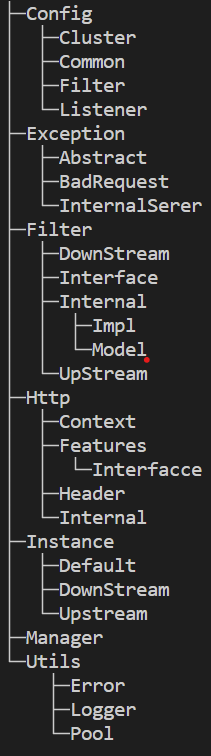
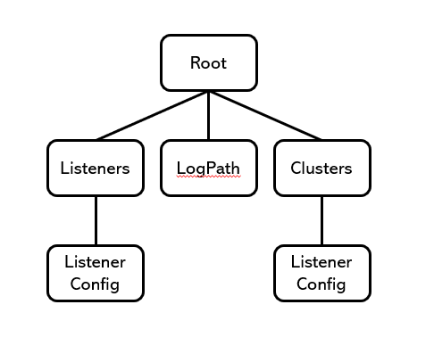

# Smile Gateway
### 1. [아키텍처](#아키텍처)
### 2. [동작 방식](#동작-방식)
### 3. [Config](#config)
### 4. [DownStream](#downstream)
### 5. [UpStream](#upstream)
### 6. [Common](#common)
### 7. [Custom](#custom)
### 8. [문제 해결 과정](#문제-해결-과정)

## 로고
<div style="position: relative; text-align: center;">
  <p align="left">
  
  </p>
  <div style="position: absolute; top: 50%; left: 50%; transform: translate(-50%, -50%); color: white; font-size: 21px;">
    Smilegate 로고</br> + </br>게이트웨이</br> = 수제작
  </div>
</div>

## 아키텍처
### Request 흐름도


### Filter Chain 흐름도 | 폴더 구조
  


## 동작 방식
- 기본적으로 **SmileGatewayConfig.yaml**을 파싱하여 작동합니다. **SmileGatewayCore**는 Smile Gateway가 작동하는 기본 토대 코드가 들어가 있습니다.

## Config
### 기본 골자

### Config 파일 설정 ([예제](./SmileGateway/SmileGatewayConfig.yaml))
- LogPath
    
    LogPath: `string`
    
- Listeners
    - name : `string`
    - Protocol : `string`
    - ThreadCount : `int`
    - RequestTimeout : `int`
    - DisallowHeaders : `List<string>`
    - Address
        - Address : `string`
        - Port : `int`
    - RouteConfig
        - Clusters : `List<string>`
    - CustomFilters : `List<CustomFilterConfig>`
        - Name : `string`
        - Path : `string`
    - Authorization
        - Type : `string`
        - LoginPath : `string`
        - LogoutPath : `string`
        - JwtValidator
            - ValidAudience : `string`
            - ValidIssuer : `string`
            - SecretKey : `string`
            - AccessTokenValidityInSecond : `int`
            - RefreshTokenValidityInSecond : `int`
- Clusters
    - Name : `string`
    - Protocol : `string`
    - Prefix : `string`
    - Authorization : `bool`
    - ConnectTimeout : `int?`
    - RequestTimeout : `int?`
    - Address
        - Address : `string`
        - Port : `int`
    - CustomFilters : `List<CustomFilterConfig>`

- [ErrorCodeResponse](./SmileGatewayCore/Utils/Error/ErrorResponse.cs) : ErrorCode 형태의 Resopnse를 생성해줍니다.
-  [ErrorCodeReader](./SmileGatewayCore/Utils/Error/ErrorCodeReader.cs) : [ErrorCode.json](./SmileGatewayCore/Utils/Error/ErrorCode.json)을 읽어서 정보를 저장하고 있습니다.
- [ConfigReader](./SmileGatewayCore/Config/ConfigReader.cs) : Smile Gateway의 기본적인 설정 파일입니다.
- [Exception](./SmileGatewayCore/Exception/) : Exception들이 들어가 있습니다.

## DownStream
- [Adapter](./SmileGatewayCore/Instance/Adapter.cs) : DownStream Filter에 넘어가는 정보를 캡슐화 합니다.
- [DownStreamFilter](./SmileGatewayCore/Filter/DownStream/DownStreamFilter.cs) : DownStream으로 들어온 HTTP 형식의 데이터를 분석하여 각 Filter에 맞는 역활을 진행합니다.
- [DownStreamFilterChain](./SmileGatewayCore/Instance/DownStream/DownStreamFilterChain.cs) : DownStreamFilter들을 묶어서 실행할 수 있도록 해줍니다.
- [Listner](./SmileGatewayCore/Instance/DownStream/Listener.cs) : Network Instance를 상속받고 있으며, Accept 및 HttpContext 전달을 담당합니다.
- [ListenerManager](./SmileGatewayCore/Manager/ListenerManager.cs) : Config를 토대로 Listener를 생성하고 실행하는 역활을 합니다.

## UpStream
- [Cluster](./SmileGatewayCore/Instance/Upstream/Cluster.cs) : Upstream Service와 통신을 담당하며, DownStream으로 온 데이터를 전송하고, 받아서 리턴하는 기능을 담당합니다. 로드 밸런서 기능도 가지고 있습니다.
- [ClusterManager](./SmileGatewayCore/Manager/ClusterManager.cs) : Config를 토대로, Cluster의 설정을 들고 있습니다.
- [ConnectionPool](./SmileGatewayCore/Instance/Upstream/ConnectionPool.cs) : UpStream과의 Connect된 Socket Pool을 관리하는 클래스입니다.
- [EndPoint](./SmileGatewayCore/Instance/Upstream/EndPoint.cs) : ConnectionPool에서 Socket을 가져와서, 실질적인 통신을 담당합니다.
- [EndPointHealthCheck](./SmileGatewayCore/Instance/Upstream/EndPointHealthCheck.cs) : 설정된 서버의 HealthCheck 기능을 담당합니다.
- [UpStreamFilter](./SmileGatewayCore/Filter/UpStream/UpStreamFilter.cs) : UpStream에서 실행되는 필터입니다.
- [UpStreamFilterChain](./SmileGatewayCore/Instance/Upstream/UpStreamFilterChains.cs) : UpStreamFilter를 Chain형식으로 들고 있어, Chain을 실행시켜줍니다.

## Common
- [Network-Instance](./SmileGatewayCore/Instance/Default/NetworkInstance.cs) : 기본적인 네트워크 통신을 담당합니다. 기본적으로 추상 클래스입니다.
- [Filter-Chain](./SmileGatewayCore/Instance/Default/IFilterChain.cs) : Filter Chain의 Interface 입니다.
- [HTTP-Context](./SmileGatewayCore/Http/Context/HttpContext.cs) : DownStream와 UpStream으로부터 들어온 byte 데이터를 HTTP 형태로 만들어주는 역활을 합니다.
- [HTTP-Request](./SmileGatewayCore/Http/Context/HttpRequest.cs) : HTTP Context에 속해 있는 Request 정보입니다.
- [HTTP-Response](./SmileGatewayCore/Http/Context/HttpResponse.cs) : HTTP Context에 속해 있는 Response 정보입니다.
- [FileLogger](./SmileGatewayCore/Utils/Logger/FileLogger.cs) : 파일에 로그를 저장하는 로거입니다.

## Custom
- **Filter**의 경우 SmileGateway에서 커스텀으로 직접 작성하여 추가할 수 있음. 단, 추가는 설정 파일에 따라서 추가가 가능함.
- 설정의 경우 Config 파일의 다음을 따라감
---
- CustomFilters : `List<CustomFilterConfig>`
    - Name : `string`
    - Path : `string`
---
- [DownStream-예시](./SmileGateway/ListenerTestFilter.cs)
- [UpStream-예시](./SmileGateway/ClusterTestFilter.cs)
  

## 문제 해결 과정

### Smile-Gateway CORS 오류 해결
- **Request, Response의 경우 Content-Type이 존재할 때, Chucked나 Multipart가 존재하면 Content-Length가 존재하면 안됨.**
- **또한 Content-Type: application-json 일 경우 Content-Length가 0으로 존재해서는 안됨.**
- 또한, 각 서버들 간의 CORS 설정도 잘 되어 있어야 하는 문제였음.
- `“https://localhost:3000”`
- 
```C#
internal class OriginalFilter : DownStreamFilter
{
    protected override void Working(Adapter adapter, HttpContext context)
    {
        context.Response.Header["Access-Control-Allow-Origin"] = context.Request.Header["Origin"];
        if (context.Request.Header.ContainsKey("Host"))
            context.Request.Header["Host"] = adapter.ListenerAddress;
    }

    protected override void Worked(Adapter adapter, HttpContext context)
    {

    }
}
```

### SmileGateway 배포
- KeepAlive 설정 같은 경우, 리눅스는 기본 커널 형식을 따라가기 때문에, 내부 코드로 설정하면 오류 발생
```C#
Socket socket = new Socket(AddressFamily.InterNetwork, SocketType.Stream, ProtocolType.Tcp);
socket.SetSocketOption(SocketOptionLevel.Socket, SocketOptionName.ReuseAddress, true);
socket.SetSocketOption(SocketOptionLevel.Socket, SocketOptionName.KeepAlive, true);

// // KeepAlive 시간 설정
// int keepAliveTime = 60 * 1000; // 60초
// socket.SetSocketOption(SocketOptionLevel.Tcp, SocketOptionName.TcpKeepAliveTime, keepAliveTime);

// // KeepAlive 간격 설정
// int keepAliveInterval = 1000; // 1초
// socket.SetSocketOption(SocketOptionLevel.Tcp, SocketOptionName.TcpKeepAliveInterval, keepAliveInterval);

// // KeepAlive 재시도 횟수 설정
// int keepAliveRetryCount = 3;
// socket.SetSocketOption(SocketOptionLevel.Tcp, SocketOptionName.TcpKeepAliveRetryCount, keepAliveRetryCount);
```

### Socket 호환성 문제
- 다음과 같이 Socket Pool을 만들어서 재 사용하려고 하니, 문제가 발생함.
- Linux의 경우 소켓 재사용이 불가능함.
```C#
Socket socket = _socketPool.RentSocket();
await _listenerSocket.AcceptAsync(socket);
```
따라서
```
Socket socket = await _listenerSocket.AcceptAsync();
Start(socket);
```

### Multipart Parsing 문제
- Multipart가 읽히지 않는 문제가 발생.
- HttpRequest를 만드는 과정에서, Continue를 통해 Content-Type의 헤더가 들어가지 않았던 문제였다.
```C#
if (header[0] == "Content-Type")
{
    if (header[1].StartsWith("multipart/form-data"))
    {
        IsMultipart = true;
        _boundary = "--" + requestLines[i].Split("boundary=")[1];
        _endBoundary = Encoding.UTF8.GetBytes(_boundary + "--");
				continue; // 여기가 문제 발생 지점
    }
}
```

### Multipart 크기 문제
- Multipart 형식으로 데이터를 받아오다 보니, 문제가 하나 발생함. 바로 메모리 풀을 잡을때 크기를 너무 크게 잡아버린것
- 그래서 처음에는 5KB만 할당하여 사용하고, 추가적으로 할당받는 방식으로 코드를 구현함
```C#
_context.Value = new HttpContext();

if (!_context.Value.Request.ByteParse(new ArraySegment<byte>(buffer.Array!, buffer.Offset, recvLen)))
{
    // Multipart의 경우 용량이 커지는 경우가 있기에 Buffer의 크기를 추가 할당
    if (_context.Value.Request.IsMultipart)
    {
        var multipartBytes = _memory.RentMultipartBytes();
        buffer = new ArraySegment<byte>(buffer.Array!.Concat(multipartBytes).ToArray());
        socket.SetSocketOption(SocketOptionLevel.Socket, SocketOptionName.ReceiveBuffer, Buffers.multipartSize);
    }

    await Receive(socket, new ArraySegment<byte>(buffer.Array!, buffer.Offset + recvLen, buffer.Count - recvLen));
}

```

### Multipart의 Byte 파싱
- Response의 Chucked와 같이 한번에 데이터가 전달되지 않고, 특히 바이트 형식으로 데이터가 전달되는 것을 파악함.
- Request의 변경이 필요하였음.
- 그래서 Response와 같이 bool을 리턴함으로써 데이터를 다 받을 때까지 receive 하는 코드로 변경함.
- 원래의 방식이였던 Encoding.UTF8.Ending에서, Byte를 읽어서 해당 바이트를 파싱하는 방식으로 변경함.
```C#
public bool ByteParse(ArraySegment<byte> bytes)
{
    // 헤더와 바디의 중간 부분 찾기
    string header = "";
    byte[] headerEnd = Encoding.UTF8.GetBytes("\r\n\r\n");
    int i = 0;
    for (; i <= bytes.Count - headerEnd.Length; i++)
    {
        if (bytes.Array!.Skip(bytes.Offset + i).Take(headerEnd.Length).SequenceEqual(headerEnd))
        {
            header = Encoding.UTF8.GetString(bytes.Array!, bytes.Offset, i);
            break;
        }
    }

    // 헤더 파싱
    ParseHeader(header);

    // 바디 파싱
    if (IsMultipart)
        return AppendMultipartBody(new ArraySegment<byte>(bytes.Array!, bytes.Offset + i, bytes.Count - i));
    else
        Body = Encoding.UTF8.GetString(bytes.Array!, bytes.Offset + i, bytes.Count - i) + "\r\n";

    return true;
}
```

### 예전 코드
```C# 
public bool Parse(string responseString)
{
    _responseFeatrue = new ResponseFeature();
    string[] responseLines = responseString.Split("\r\n");
    MakeResponseinfo(responseLines[0].Split(" "));

    // HttpContext 분리 생성
    // Body 형태가 다름. 그래서 따로 해줘야함.
    bool isSuccess = true;
    for (int i = 1; i < responseLines.Length; i++)
    {
        if (responseLines[i] == "")
        {
            if (IsChucked)
                isSuccess = MakeChuckedBody(responseLines.Skip(i + 1).ToArray());
            else
                Body = string.Join("\r\n", responseLines.ToArray(), i + 1, responseLines.Length - i - 1);
            break;
        }

        string[] header = responseLines[i].Split(": ");

        if (header[0] == "Vary")
        {
            Varys.Add(responseLines[i]);
            continue;
        }

        if (header[0] == "Set-Cookie")
        {
            Header.SetCookie = header[1];
            continue;
        }
        if (header[0] == "Content-Length")
        {
            _responseFeatrue.ContentLength = int.Parse(header[1]);
            continue;
        }
        if (header[0] == "Transfer-Encoding" && header[1] == "chunked")
        {
            IsChucked = true;
            continue;
        }

        if (header.Length > 1)
            Header.Add(header[0], header[1]);
    }

    _responseCookie = new ResponseCookie(Header);

    return isSuccess;
}
```

### HttpRequest
- “Host”가 APIGateway IP가 맞지 않을 경우 문제가 발생함
- “Origin”도 CORS 문제를 일으킬 수 있음
- **`Host`** 요청 헤더는 (가상 호스팅을 위해) 서버의 도메인명과 서버가 리스닝하는 (부가적인) TCP 포트를 특정합니다.
- 즉 http://가 붙으면 오류가 발생한다..
- 또한 Origin이랑 Server에 있는 CORS 설정이랑 같아야됨..
  
### HttpResponse
- "Access-Control-Allow-Origin” 가 문제를 일으킬 수 있음
- Content-Length에 다 담겨서 오는데 아닌 Chucked 방식으로 데이터가 올 수 있음

### ConnectionPool 제작
- Connection Pool을 제작하는 과정에서의 어려움
  - 클라이언트 측에서 Disconnect를 하게 되어도, 해당 포트가 바로 사용 가능하거나, 소켓이 종료되는 것이 아닌 TIME_WAIT 에 걸리게 된다. 
    


```csharp
socket.SetSocketOption(SocketOptionLevel.Socket, SocketOptionName.ReuseAddress, true);
socket.SetSocketOption(SocketOptionLevel.Socket, SocketOptionName.KeepAlive, true);
```

- socket 설정은 다음과 같은데, Reuse로 똑같은 IPEndPoint를 사용하기 위함이다.
- 또한 Disconnect(reuse: true)로 해야 소켓을 재사용할 수 있다.
- Dispose나 Close의 경우 소켓의 재 사용이 불가능하다.
