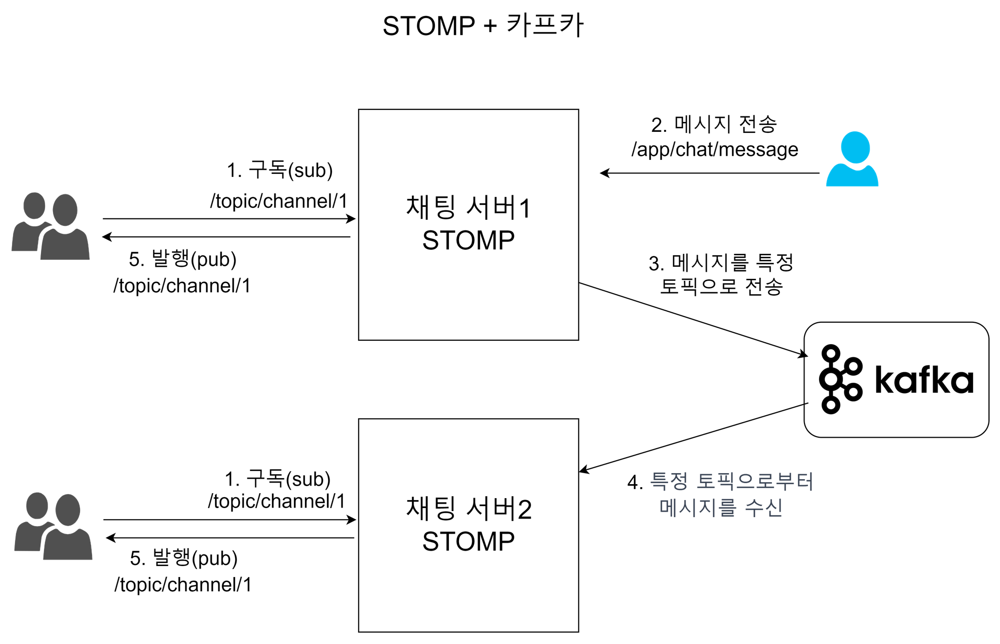
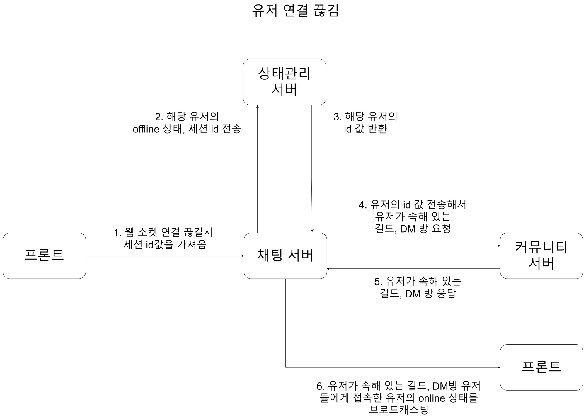

# 채팅 서버

## 기술스택

- Java 17
- Spring Boot 3.2.1
- Spring MVC
- WebSocket, STOMP
- Kafka
- Redis
- MongoDB

## 기능 정리

| 구현 기능 | 설명                                                                             |
| --- |--------------------------------------------------------------------------------|
| 채팅 CRUD | 기본적인 채팅 기능(파일 업로드 포함)                                                          |
| 이모지 | 채팅 메시지에 마우스를 가져다 대고 클릭한 후 이모지를 선택하여 해당 메시지에 이모지 반응을 추가                         |
| online,offline 상태 감지 | 스프링 channelinterceptor를 통해 웹 소켓 connect, disconnect로 유저의 online,offline 상태를 판단 |
| kafka를 이용한 다중 채팅 서버 | kafka를 이용한 다중 채팅 서버 채팅 메시지 동기화 작업, 채팅 서버에 채팅 메시지 토픽에 대한 producer, consumer 구현  |
| 타이핑 인디케이터 | 사용자가 메시지를 입력 중일 때 같은 채널을 보고 있는 사용자들에게 채팅을 전송 중임을 알리는 기능                        |

## 기능 시퀀스 다이어그램

### 채팅 CRUD


- MongoDB에 접근하여 데이터를 처리하는 CRUD 서비스 로직과 다중 채팅 서버를 위한 카프카 서비스 로직을 분리
- 카프카 장애 등의 문제가 발생할 경우 데이터 일관성을 유지하기 위해 MongoDB에 우선 데이터를 저장 후 카프카 서비스 로직을 진행

## 아키텍처


## **핵심 구현 기능**

### 1. STOMP와 Kafka를 이용한 다중 채팅 서버 구현



- STOMP를 통해 채팅 메시지에 대한 송신과 수신을 처리
- 카프카를 통해 다중 채팅 서버간에 채팅 메시지를 동기화

``` java
    @KafkaListener(topics = "${spring.kafka.topic.community-chat}", groupId = "${spring.kafka.consumer.group-id.community}", containerFactory = "communityListener")
    public void consumeForCommunity(CommunityMessageDto messageDto){
        messagingTemplate.convertAndSend("/topic/guild/" + messageDto.getGuildId(), messageDto);
    }

    @KafkaListener(topics = "${spring.kafka.topic.direct-chat}", groupId = "${spring.kafka.consumer.group-id.direct}", containerFactory = "directListener")
    public void consumeForDirect(DirectMessageDto messageDto){
        messagingTemplate.convertAndSend("/topic/direct/" + messageDto.getRoomId(), messageDto);
    }

    @KafkaListener(topics = "${spring.kafka.topic.emoji-chat}", groupId = "${spring.kafka.consumer.group-id.emoji}", containerFactory = "emojiListener")
    public void consumeForEmoji(EmojiDto emojiDto){
        if (emojiDto.getRoomId() > 0) {
            messagingTemplate.convertAndSend("/topic/direct/" + emojiDto.getRoomId(), emojiDto);
        }
        if (emojiDto.getGuildId() > 0) {
            messagingTemplate.convertAndSend("/topic/guild/" + emojiDto.getGuildId(), emojiDto);
        }
    }
```

### 2. ChannelInterceptor를 구현하여 유저의 실시간 온,오프 상태 처리

``` java
@Slf4j
@Component
@RequiredArgsConstructor
public class FilterInboundChannel implements ChannelInterceptor {

    ....

    @Override
    public void postSend(Message<?> message, MessageChannel channel, boolean sent) {
        StompHeaderAccessor headerAccessor = StompHeaderAccessor.wrap(message);

        if (StompCommand.CONNECT.equals(headerAccessor.getCommand())) {
            Long userId = Long.parseLong(Objects.requireNonNull(headerAccessor.getFirstNativeHeader("userId")));
            String sessionId = headerAccessor.getSessionId();
            SessionDto sessionDto = SessionDto.builder()
                    .userId(userId)
                    .sessionId(sessionId)
                    .type("CONNECT")
                    .state("online")
                    .build();
            messageService.sendMessageForSession(sessionDto);

            CommunityFeignResponse ids = communityClient.getGuildAndRoomIds(userId);
            ConnectionEventDto connectionEventDto = ConnectionEventDto.builder()
                    .userId(userId)
                    .type("CONNECT")
                    .state("online")
                    .guildIds(ids.getResultData().getGuildIds())
                    .roomIds(ids.getResultData().getRoomIds())
                    .build();
            messageService.sendMessageForConnectionEvent(connectionEventDto);
        }

        if (StompCommand.DISCONNECT.equals(headerAccessor.getCommand())) {
            String sessionId = headerAccessor.getSessionId();
            SessionDto sessionDto = SessionDto.builder()
                    .sessionId(sessionId)
                    .type("DISCONNECT")
                    .state("offline")
                    .build();

            String checkUserId = stateClient.updateSession(sessionDto).getResult();
            if (checkUserId != null) {
                Long userId = Long.parseLong(checkUserId);

                CommunityFeignResponse ids = communityClient.getGuildAndRoomIds(userId);
                ConnectionEventDto connectionEventDto = ConnectionEventDto.builder()
                        .userId(userId)
                        .type("DISCONNECT")
                        .state("offline")
                        .guildIds(ids.getResultData().getGuildIds())
                        .roomIds(ids.getResultData().getRoomIds())
                        .build();
                messageService.sendMessageForConnectionEvent(connectionEventDto);
            }
        }
    }
}
```

- 유저 연결 로직 흐름


- 유저 연결 끊김 로직

