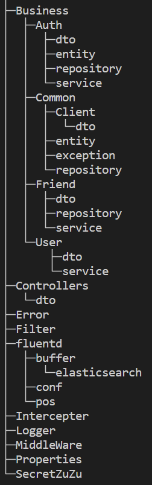

# 유저 서버
### 1. [서버 아키텍처](#서버-아키텍처)
### 2. [동작 방식](#동작-방식)
### 3. [구현 기능 목록](#구현-기능-목록)
### 4. [트러블 슈팅](#트러블-슈팅)

## 서버 아키텍처
| 종류         | 기술                                                              |
| ------------ | ----------------------------------------------------------------- |
| **Language** | `ASP.NET Core 6`, `C#`                                            |
| **Database** | `MSSQL`, `Redis`                                                  |
| **Token**    | `JWT`                                                             |
| **Library**  | `Castle.Core`, `MailKit`, `SmtpServer`, `Google.Cloud.Storage.V1` |

### 폴더 구조



## 동작 방식
### Auth
- 로그인 및 로그 아웃의 경우, Smile Gateway와의 Config 설정을 통해 JWT 토큰 발급 및 삭제를 진행합니다.
- 현재는 `/api/auth/login`, `/api/user/logout`이 `PATH`로 설정되어 있습니다.

### User
- 유저의 경우 Community 서버와의 통신을 통해 이름, 프로필 변경 등의 동기화를 진행합니다.
- 이름의 경우, 한글 영어 이름 모두 가능합니다.

### Friend
- 친구 추가 삭제 등과 같은 경우, Community와의 통신을 통해 친구 목록을 동기화를 진행합니다.
- 친구 목록의 경우 State 서버와의 통신을 통해 해당 유저의 접속 여부를 파악할 수 있습니다.

### 로깅
- [FileLogger]()를 통해 파일에 로그를 저장합니다.
- 로그는 AOP를 위해 Castle 라이브러리를 사용하였으며 기본적인 로그는 [LogMiddleware]()에서 저장됩니다.
- AOP 패턴의 경우 [LogIntercepter]()를 통해 로깅이 진행됩니다.
- 로그 형태는 다음과 같습니다.
``` 
{"@timestamp":"2024-02-20 17:09:03.608 ","level":"INFO","service":"user-service","trace":"","apiAddr":"","httpMethod":"PATCH","userId":"","message":"message"}
```
- `Queue`를 통해 로그가 저장되고, `Timer`를 통해 로그가 파일에 저장됩니다. 멀티 스레드의 동시 접근을 방지가 위해 `Queue`는 `ConCurrentQueue`로 선언되어 있습니다.
``` C#
public class FileLogger: IBaseLogger
{
    public ConcurrentQueue<LogModel> _queue = new ConcurrentQueue<LogModel>();

    public FileLogger(IConfiguration config)
    {
        _config = config;
        _path = _config["Logger:LogPath"];
        Timer timer = new Timer();
        timer.Interval = 1000;
        timer.Elapsed += (sender, args) =>
        {
            List<LogModel> logs;
            PopAll(out logs);
            if (logs.Count > 0)
            {
                try
                {
                    using (StreamWriter sw = File.AppendText(_path))
                    {
                        foreach (var log in logs)
                        {
                            sw.WriteLine(log.ToString());
                        }
                    }

                }
                catch
                {
                    // 로그 파일이 없을 경우 생성
                    using (StreamWriter sw = File.CreateText(_path))
                    {
                        foreach (var log in logs)
                        {
                            string json = JsonSerializer.Serialize(log);
                            sw.WriteLine(json);
                        }
                    }
                }
            }
        };
        timer.Start();
    }
}
```

### 에러 처리
- 에러 처리는 두 곳에서 일어나게 됩니다.
- **InvalidModel**
```
builder.Services.AddControllers().ConfigureApiBehaviorOptions(options =>
{
    options.InvalidModelStateResponseFactory = CustomErrorHandler.ModelStateErrorHandler;
});
```
- **ExceptionMiddleware**
```
app.UseExceptionHandler(exceptionHandlerApp =>
{
    exceptionHandlerApp.Run(CustomErrorHandler.MyRequestDelegate);
});
```
- 에러 코드는 [ErrorCode.json]() 형태로 리턴하게 됩니다.
- 또한, 모든 Exception은 Custom으로 만들어진 Exception을 호출하게 됩니다.

### 다른 서버와의 통신
- 서버와의 통신을 구현하여 이를 의존성 주입으로 넣어둠.
- `HttpClient`를 사용하여 통신을 진행함.
- 다음은 예시이며, 다음과 같은 코드 형태로 작성되어 있음.
```C#
public async Task<bool> RegisterUserAsync(CommunityUserDTO communityDTO, string traceId)
{
    SetDefaultHeader(traceId.ToString(), "");

    try
    {
        HttpResponseMessage response = await _client.PostAsync("registration/user", CreateJsonContent(communityDTO), _cancellationToken);
        string str = await response.Content.ReadAsStringAsync();
        var dto = JsonConvert.DeserializeObject<CommunityResponseDTO>(str);
        if (dto == null)
            System.Console.WriteLine("Response is null");
        if (dto!.ResultCode != 200)
        {
            var exception = JsonConvert.DeserializeObject<CommunityBaseException>(dto.ResultData);
            System.Console.WriteLine(exception!.Message);
            throw new ServiceException(4010);
        }
    }
    catch (Exception e)
    {
        System.Console.WriteLine(e.Message);

        return false;
    }

    return true;
}

```
### Dababase
- `EntityFrameWork`를 사용하지 않고, SQL 구문으로 Database에 접근함.
- Redis 또한 로우하게 접근함.


## 구현 기능 목록
### Auth
- 로그인
- 회원가입
    - 이메일 체크섬 요청
- 비밀번호 리셋
- JWT 토큰의 경우, Smile Gateway에서 발급함.
- [POSTMAN API](https://documenter.getpostman.com/view/23764817/2s9YsNeAXH)

### User
- 사용자 프로필 변경
- 사용자 이름 변경
- 비밀번호 변경
- [POSTMAN API](https://documenter.getpostman.com/view/23764817/2sA2rAy2iL)

### Friend
- 친구 추가
- 친구 추가 거절
- 친구 추가 취소
- 친구 추가 허락
- 친구 리스트
- 친구 삭제
- [POSTMAN API](https://documenter.getpostman.com/view/23764817/2sA2rAyMay)

## 트러블 슈팅
### 한글 이름 이슈
- 초기 테이블의 경우 이름의 경우 한글을 고려하지 않아 COLUMN 타입을 `VARCHAR`로 선언함.
- 이와 같은 경우, 한글을 넣게 되면 `???`로 출력되는 문제가 발생함.

- 따라서 `NVARCHAR`로 타입을 지정해야 하며, `INSERT` 문을 진행할 떄, `NVARCHAR`로 선언된 컬럼의 경우
`N'~~'`와 같이 `N`을 붙여야 함.

``` SQL
INSERT INTO users (name, profile) VALUES (N'name', 'sql')";
```

### JWT Token
- JWT 토큰 발급 및 삭제의 경우 초반에는 유저 서버에서 진행함.
- 그러나 Smile Gateway를 제작하는 과정에서 인증 관련 기능을 게이트웨이로 이전
- Auth Controller 관련된 코드가 많이 수정됨

- 설계의 미스

### 커뮤니티, 상태 관리 서버와의 통신
- 진행 방식의 변경이 있었음.
  1. 해당 서버의 URL을 손수 넣어서 `Post`, `Get`, `Patch` 등을 실행함.
  2. API Gateway의 `4040`포트를 내부 포트로 설정하여 API Gateway를 통해 서버 간의 통신을 진행함.
- API Gateway의 오류로 인해 String의 마지막 문자가 읽히지 않는 문제가 발생.

- Logging과 디버깅으로 해당 문제를 찾았고, 근본적인 문제를 해결함. 이후에는 잘 작동

### 로깅
- 로깅의 경우 `Controller`, `Service`, `repository` 등을 거치면서 모두 로그가 남아야되는 상황에서
그냥 로그를 기록할 경우 모든 코드에 로그가 기록되야 하는 상황 발생
- 또한, 그렇게 구현할 경우 하나를 수정하려면 모든 코드를 수정해야 하는 상황이 발생함.
- 따라서 AOP 패턴을 구현할 수 있게 해주는 `Castle` 패턴을 사용함.
  
- `Castle`을 사용하기 위해 LogIntercepter를 구현하여, 의존성 주입을 함.
``` CSharp
builder.Services.AddSingleton<IBaseLogger, FileLogger>();

builder.Services.AddHttpContextAccessor();
builder.Services.AddScoped<LogInterceptor>();
```
- 사용 방식
```CSharp
 _userService = generator.CreateInterfaceProxyWithTarget<IUserService>(userService, new LogInterceptor(logger, accessor));
```
- 다음과 같이 사용하는 경우, 필수적으로 `서비스`, `레포지토리`가 무조건 Interface를 상속받고 있어야 합니다.

``` C#
public class LogInterceptor : IInterceptor
{
    private IBaseLogger _logger;
    private IHttpContextAccessor _contextAccessor;
    public LogInterceptor(IBaseLogger logger, IHttpContextAccessor contextAccessor)
    {
        _logger = logger;
        _contextAccessor = contextAccessor;
    }

    public void Intercept(IInvocation invocation)
    {
        HttpContext context = _contextAccessor.HttpContext!;
        string traceId = context.Request.Headers["trace-id"];
        string userId = context.Request.Headers["user-id"];

        // 전
        _logger.LogInformation(
            traceId: traceId,
            method: context.Request.Method,
            userId: userId,
            message: invocation.Method.Name + " start",
            apiAddr: context.Connection.RemoteIpAddress!.ToString());

        invocation.Proceed();

        // 후
        _logger.LogInformation(
            traceId: traceId,
            method: context.Request.Method,
            userId: userId,
            message: invocation.Method.Name + " end",
            apiAddr: context.Connection.RemoteIpAddress!.ToString());
    }
}
```

### CORS 설정 오류
- 배포 상황이 여러번 바뀌다보니 CORS 설정의 오류가 여러번 발생함.
  
- `http://localhost:3000`, `http://24.220.109.45:3000`, `https://localhost:3000` 등 여러번의 CORS 설정이 바뀌었음.
  
- CORS 설정은 프론트 서버의 설정에 따라 바뀌어야 하며, 이를 따라가야 함.

```
// CORS 설정
builder.Services.AddCors(options =>
{
    options.AddPolicy("AllowReact", builder =>
    {
        builder.WithOrigins("http://localhost:3000")    // 리액트 앱의 주소
                .WithOrigins("http://10.99.29.133:3000") // 리액트 앱의 주소
                .WithOrigins("http://127.0.0.1:3000") // 리액트 앱의 주소
                .WithOrigins("https://127.0.0.1:3000") // 리액트 앱의 주소
                .WithOrigins("https://localhost:3000")
                .AllowAnyHeader()
                .AllowAnyMethod();
    });

    options.AddDefaultPolicy(builder =>
    {
        builder.AllowAnyOrigin()
                .AllowAnyHeader()
                .AllowAnyMethod();
    });
});

app.UseCors("AllowReact");
```

### Database
- `Microsoft.Data.SqlClient`를 사용할 경우 다음과 같은 에러가 발생할 수 있음
- `SqlConnection`, `SqlCommand`, `SqlDataReader`를 `using`을 사용하지 않고 그냥 사용할 경우
동시 접근하게 되면 에러가 발생함, (연결이 끊기지 않았는데 동시 접근하기 때문에)
  
- 이를 해결하기 위해서는 무조건 `using`을 사용해서 데이터를 쓰거나 읽어야 함.
  
- 특히 `ExecubeReader` 함수를 사용하게 되면 `using`을 필수로 써야함.
  
- 또한 DB의 경우 자동으로 DB 풀에서 연결을 가져와서 사용하는 것이기 때문에 새로 생성 X
``` C#
public List<T> ExecuteReader<T>(string query, Func<IDataReader, T> createInstance)
{
    try
    {
        using (SqlConnection connection = new SqlConnection(_connectionString))
        {
            connection.Open();

            List<T> datas = new List<T>();

            using (SqlCommand command = new SqlCommand(query, connection))
            using (var reader = command.ExecuteReader())
            {
                while (reader.Read())
                {
                    datas.Add(createInstance(reader));
                }
            }

            return datas;
        }
    }
    catch (Exception e)
    {
        throw new user_service.common.exception.SqlException(e.Message);
    }
}
```